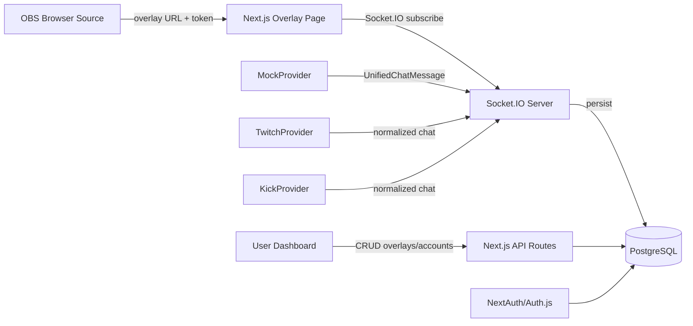
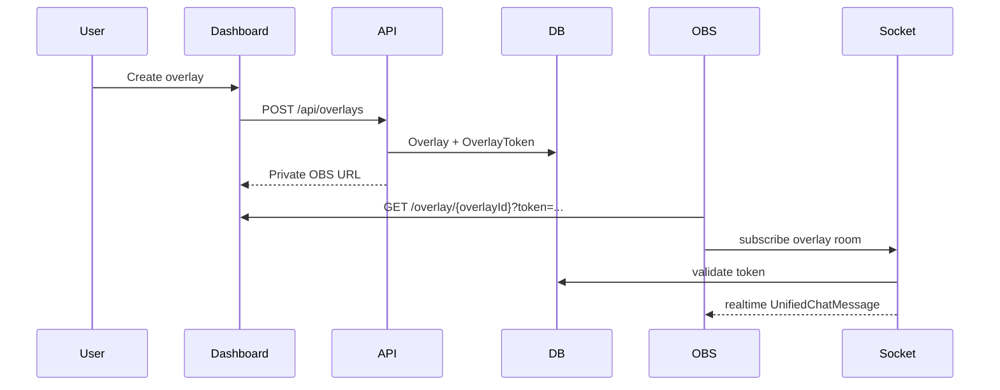

# StreamFusion

StreamFusion is a production-ready SaaS starter for aggregating Twitch, Kick, and X/Twitter-style chat events into one OBS browser-source overlay. It ships with a development `MockProvider`, so it runs immediately without external platform credentials.

## Stack

- Next.js 15 App Router
- TypeScript
- Tailwind CSS
- PostgreSQL
- Prisma ORM
- NextAuth/Auth.js credentials auth
- Socket.IO realtime overlay updates
- Docker and Railway deployment support

## Quick Start

```bash
cp .env.example .env
docker compose up --build
```

Open `http://localhost:3000`, register a user, create an overlay, then open the generated OBS URL. The mock chat provider emits messages automatically.

Local development without Docker:

```bash
npm install
npm run prisma:generate
npm run prisma:migrate
npm run dev
```

## Environment

Generate `TOKEN_ENCRYPTION_KEY` with:

```bash
openssl rand -base64 32
```

`MOCK_PROVIDER_ENABLED=true` enables the mock realtime chat stream. Twitch and Kick OAuth are implemented behind `/api/oauth/{provider}/connect`; add client credentials to enable them.

## Project Structure

```text
apps/web              Next.js app, Prisma schema, Socket.IO server
packages/shared      Shared types, constants, validation helpers
packages/chat-core   Provider interface and Twitch/Kick/Mock providers
```

## Architecture





## Provider Model

Every provider implements:

```ts
interface IChatProvider {
  connect(): Promise<void>;
  disconnect(): Promise<void>;
  subscribe(handler: (message: UnifiedChatMessage) => void): () => void;
  normalizeMessage(raw: unknown): UnifiedChatMessage;
}
```

`MockProvider` is enabled by default. Twitch and Kick OAuth account connection is included; their live chat integrations can be expanded behind the same provider contract without changing the overlay or dashboard.

## Railway

Create a Railway PostgreSQL service, set the variables from `.env.example`, and deploy this repository. `railway.json` runs Prisma migrations before starting the app.
